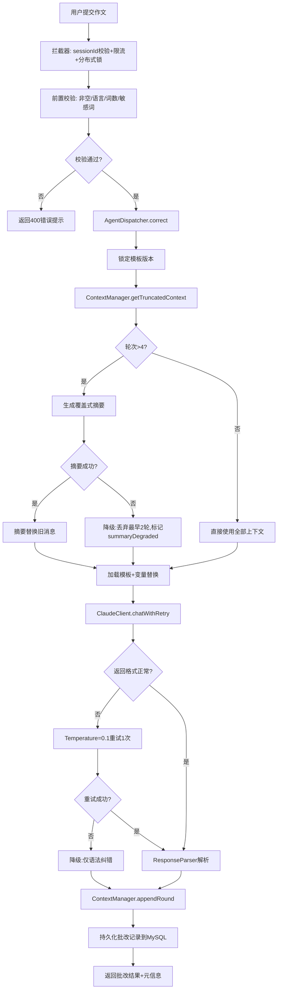
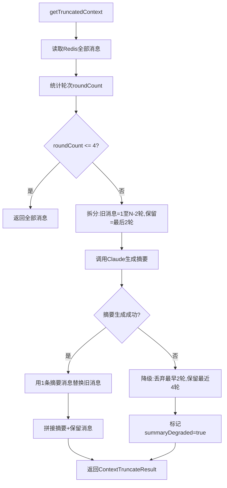

# 03_Agent详细设计
## 考研英语作文批改自研Agent

> 版本：v1.0 | 日期：2026-08-26 | 对应文档：`01_需求清单.md`、`02_总体方案.md`

---

## 1. Agent定位与边界

### 1.1 定位
本Agent是考研英语作文批改系统的**核心调度组件**，负责串联Prompt模板加载、上下文管理、大模型调用、结果解析与容错降级，实现作文出题、范文生成、作文批改三大能力。

**不使用LangChain、Superpowers等任何现成Agent框架**，全部调度逻辑自研。

### 1.2 职责边界
| Agent负责 | Agent不负责 |
|-----------|-------------|
| Prompt模板加载与变量替换 | 前端页面渲染 |
| 会话上下文滑动窗口管理 | 用户注册登录 |
| 覆盖式摘要生成与降级 | 图片存储与静态资源服务 |
| Claude API封装调用与重试 | OCR接口封装（独立模块） |
| 大模型返回JSON解析与容错 | 历史记录持久化（Service层） |
| 模板版本灰度锁定 | 限流与分布式锁（拦截器层） |

### 1.3 核心设计原则
1. **单一职责**：每个核心类只做一件事，Dispatcher只做编排
2. **可降级**：任何一步失败都有兜底策略，不阻断主流程
3. **可观测**：每次调用记录Token消耗、耗时、模板版本、降级标记
4. **无状态**：Agent本身无状态，所有会话状态存Redis

---

## 2. Java包结构

```
com.essay.agent
├── controller
│   ├── TopicController.java          # 随机出题
│   ├── EssayController.java          # 范文生成、作文批改、重新批改
│   ├── OcrController.java            # 图片上传OCR
│   ├── HistoryController.java        # 历史记录查询
│   ├── SessionController.java        # 会话管理
│   └── ReportController.java         # 报告导出
├── service
│   ├── AgentDispatcher.java          # ★ Agent主调度器（核心入口）
│   ├── ClaudeClient.java             # ★ Claude API封装
│   ├── ContextManager.java           # ★ 上下文滑动窗口+摘要管理
│   ├── PromptTemplateService.java    # ★ Prompt模板加载+变量替换+版本锁定
│   ├── ResponseParser.java           # ★ 大模型返回解析+容错
│   ├── TopicService.java             # 出题业务
│   ├── EssayService.java             # 批改业务
│   ├── OcrService.java               # OCR业务
│   ├── HistoryService.java           # 历史记录业务
│   └── SessionService.java           # 会话业务
├── model
│   ├── dto
│   │   ├── request
│   │   │   ├── TopicGenerateRequest.java
│   │   │   ├── EssayReferenceRequest.java
│   │   │   ├── EssayCorrectRequest.java
│   │   │   └── ReCorrectRequest.java
│   │   └── response
│   │       ├── TopicGenerateResponse.java
│   │       ├── EssayReferenceResponse.java
│   │       ├── EssayCorrectResponse.java
│   │       └── ApiResponse.java      # 统一返回体
│   ├── entity
│   │   ├── EssayRecord.java
│   │   └── PromptTemplate.java
│   ├── enums
│   │   ├── EssayType.java            # EN1_PICTURE / EN2_CHART / LETTER
│   │   ├── AgentTaskType.java        # TOPIC / REFERENCE / CORRECT
│   │   └── SessionStatus.java        # ACTIVE / EXPIRED
│   └── agent
│       ├── Message.java              # 对话消息（role/content）
│       ├── ClaudeRequest.java        # Claude API请求体
│       ├── ClaudeResponse.java       # Claude API返回体
│       ├── ContextTruncateResult.java# 上下文截断结果
│       ├── TemplateVersion.java      # 模板版本锁定信息
│       ├── EssayCorrectResult.java   # 批改结果结构化对象
│       └── OcrResult.java            # OCR识别结果（含单词级置信度）
├── mapper
│   ├── EssayRecordMapper.java
│   └── PromptTemplateMapper.java
├── config
│   ├── ClaudeConfig.java             # Claude API配置
│   ├── RedisConfig.java
│   ├── ThreadPoolConfig.java
│   └── WebMvcConfig.java             # 静态资源映射
├── interceptor
│   ├── SessionInterceptor.java       # sessionId校验+X-Session-Status
│   ├── RateLimitInterceptor.java     # 限流
│   └── ConcurrentLockInterceptor.java # 分布式锁
└── common
    ├── exception
    │   ├── BusinessException.java
    │   └── GlobalExceptionHandler.java
    ├── util
    │   ├── TokenEstimator.java       # Token估算工具
    │   ├── LanguageDetector.java     # 语言检测工具
    │   ├── WordCounter.java          # 词数统计工具
    │   └── MarkdownSanitizer.java    # Markdown净化工具
    └── constant
        ├── RedisKeyConstants.java    # Redis key前缀常量
        └── ErrorCodeConstants.java   # 错误码常量
```

---

## 3. 核心类详细设计

### 3.1 AgentDispatcher（主调度器）

**职责**：编排整个Agent调用流程，是所有Agent任务的唯一入口。

```java
@Service
public class AgentDispatcher {

    @Autowired private PromptTemplateService templateService;
    @Autowired private ContextManager contextManager;
    @Autowired private ClaudeClient claudeClient;
    @Autowired private ResponseParser responseParser;
    @Autowired private HistoryService historyService;

    /**
     * 作文批改主流程
     * @param request 批改请求（sessionId, essayType, topic, userEssay, imageUrl）
     * @return 批改结果 + 元信息（templateId, templateVersion, summaryDegraded）
     */
    public EssayCorrectResponse correct(EssayCorrectRequest request);

    /**
     * 随机出题
     * @param request 出题请求（sessionId, essayType）
     * @return 题目描述 + 写作要求
     */
    public TopicGenerateResponse generateTopic(TopicGenerateRequest request);

    /**
     * 生成参考范文
     * @param request 范文请求（sessionId, essayType, topic）
     * @return 范文内容
     */
    public EssayReferenceResponse generateReference(EssayReferenceRequest request);
}
```

**correct() 内部执行步骤**：
1. 锁定/获取当前会话的模板版本（PromptTemplateService）
2. 从Redis获取会话上下文（ContextManager）
3. 执行滑动窗口截断，必要时生成摘要（ContextManager）
4. 加载Prompt模板，替换变量（PromptTemplateService）
5. 组装完整请求体，调用Claude API（ClaudeClient）
6. 解析返回JSON，异常时重试/降级（ResponseParser）
7. 将本轮对话追加到Redis上下文（ContextManager）
8. 持久化批改记录到MySQL（HistoryService）
9. 组装响应返回

---

### 3.2 ClaudeClient（Claude API封装）

**职责**：封装Claude HTTP调用，处理超时、重试、鉴权。

```java
@Component
public class ClaudeClient {

    @Value("${claude.api-key}") private String apiKey;
    @Value("${claude.base-url}") private String baseUrl;
    @Value("${claude.model}") private String model;
    @Value("${claude.timeout-seconds:30}") private int timeoutSeconds;

    /**
     * 调用Claude对话接口（HTTP层重试）
     * 网络超时/5xx错误时自动重试，最多重试2次，指数退避
     * @param systemPrompt 系统提示词
     * @param messages 对话消息列表
     * @param temperature 温度参数
     * @param maxTokens 最大输出token
     * @return Claude原始返回体
     * @throws BusinessException 超时/网络异常/鉴权失败（重试耗尽后抛出）
     */
    public ClaudeResponse chat(String systemPrompt, List<Message> messages,
                                double temperature, int maxTokens);

    /**
     * 带格式层重试的调用（两层重试）
     * 第一层：HTTP层重试（chat方法内置，网络超时/5xx，最多2次）
     * 第二层：格式层重试（JSON解析失败时，temperature降至0.1重试1次）
     * 注意：格式层重试由ResponseParser触发，不在ClaudeClient内部判断
     */
    public ClaudeResponse chatWithRetry(String systemPrompt, List<Message> messages,
                                         double temperature, int maxTokens);
}
```

**关键实现细节**：
- 使用Spring `RestTemplate` 或 `OkHttp` 发送POST请求
- 请求头：`Authorization: Bearer {apiKey}`、`Content-Type: application/json`、`anthropic-version: 2023-06-01`
- **两层重试机制**：
  - HTTP层（chat方法内置）：网络超时、5xx错误自动重试，最多2次，指数退避（1s→2s）
  - 格式层（chatWithRetry+ResponseParser协作）：第一次调用后ResponseParser校验JSON失败，自动用temperature=0.1重新调用1次
- 超时时间30秒，超时抛出BusinessException由Dispatcher降级处理
- 每次调用记录：请求token数、响应token数、耗时、状态码
- **Usage字段解析**：ClaudeResponse 包含内部类 `Usage`（`input_tokens`、`output_tokens`），每次调用后从响应中提取，用于：
  - 日志记录（INFO级别输出token消耗）
  - 全局TPM限流计数（固定窗口计数器，每分钟一个key，INCR累加token消耗）
  - 监控埋点（Token消耗指标）

**ClaudeResponse 结构**：
```java
public class ClaudeResponse {
    private String id;
    private String type;
    private String role;            // "assistant"
    private List<ContentBlock> content; // 内容块，text类型取text字段
    private String stopReason;      // "end_turn" / "max_tokens" / "stop_sequence"
    private Usage usage;            // Token消耗统计

    public static class Usage {
        private int inputTokens;    // 输入token数
        private int outputTokens;   // 输出token数
    }

    public static class ContentBlock {
        private String type;        // "text" / "tool_use"
        private String text;        // type=text时的文本内容
    }
}
```

---

### 3.3 ContextManager（上下文管理器）

**职责**：管理Redis中的会话对话历史，实现滑动窗口截断、覆盖式摘要生成、降级策略。

```java
@Service
public class ContextManager {

    @Autowired private RedisTemplate<String, Object> redisTemplate;
    @Autowired private ClaudeClient claudeClient;
    @Autowired private TokenEstimator tokenEstimator;

    private static final String SESSION_KEY = "session:%s";
    private static final int MAX_ROUNDS = 10;       // 最大迭代轮次
    private static final int KEEP_RECENT_ROUNDS = 2; // 滑动窗口保留最近完整轮次
    private static final int TRIGGER_THRESHOLD = 4;  // 超过4轮触发摘要
    private static final int SUMMARY_TIMEOUT_SECONDS = 15; // 摘要生成超时15秒

    /**
     * 获取并截断上下文（核心方法）
     * @param sessionId 会话ID
     * @return 截断后的消息列表 + 降级标记
     */
    public ContextTruncateResult getTruncatedContext(String sessionId);

    /**
     * 追加一轮对话到Redis
     * @param sessionId 会话ID
     * @param userMessage 用户消息
     * @param assistantMessage Agent回复消息
     */
    public void appendRound(String sessionId, Message userMessage, Message assistantMessage);

    /**
     * 清空会话上下文及所有关联数据
     * 删除所有 session:{sessionId} 前缀的Key，包括：
     * session:{sessionId}（对话上下文）、template:lock:{sessionId}（模板锁定）、
     * vocab:{sessionId}（生词本）等
     */
    public void clearContext(String sessionId);

    /**
     * 获取当前轮次计数
     * 直接从消息列表计算：messages.size() / 2（每轮=1条user+1条assistant）
     * 不额外存储round计数，避免一致性问题
     */
    public int getRoundCount(String sessionId);

    /**
     * 生成覆盖式摘要（内部方法，15秒超时）
     * 将第1轮至第(N-2)轮的对话交给Claude生成摘要，替换原始记录
     * 使用 CompletableFuture.supplyAsync() + orTimeout(15, SECONDS) 控制超时
     * （不使用@Async注解，避免private方法代理失效问题，使用自定义线程池）
     * 超时则返回null触发降级策略
     * @param sessionId 会话ID
     * @param oldMessages 需要摘要的历史消息
     * @return 摘要文本；生成失败/超时返回null触发降级
     */
    private String generateSummary(String sessionId, List<Message> oldMessages);
}
```

**ContextTruncateResult 结构**：
```java
public class ContextTruncateResult {
    private List<Message> messages;       // 截断后的消息列表
    private boolean summaryDegraded;      // 是否触发了摘要降级
    private String summary;               // 生成的摘要（未降级时为null）
    private int originalRoundCount;       // 截断前轮次数
    private int finalRoundCount;          // 截断后轮次数
}
```

**getTruncatedContext() 核心逻辑（伪代码）**：
```
1. 从Redis读取会话全部消息列表
2. 统计轮次数 roundCount（每对user+assistant算1轮）
3. 如果 roundCount <= TRIGGER_THRESHOLD(4):
     直接返回全部消息，summaryDegraded=false
4. 如果 roundCount > TRIGGER_THRESHOLD:
     a. 取出需要摘要的消息 = 第1轮 ~ 第(roundCount - KEEP_RECENT_ROUNDS)轮
     b. 取出保留的消息 = 最后 KEEP_RECENT_ROUNDS(2) 轮
     c. 调用 generateSummary() 生成摘要
     d. 如果摘要生成成功:
          用1条摘要消息替换旧消息，拼接保留消息，返回
          summaryDegraded=false
     e. 如果摘要生成失败(超时/异常):
          降级：直接丢弃最早2轮，保留最近4轮完整消息
          summaryDegraded=true
5. 返回结果
```

**摘要生成Prompt（内部固定）**：
```
你是一个对话摘要助手。请将以下考研英语作文批改对话历史压缩为一段不超过200字的摘要，
保留关键信息：作文题目、作文类型、用户主要修改点、Agent指出的核心问题。
不要保留细节，只保留对后续批改有参考价值的信息。
```

---

### 3.4 PromptTemplateService（模板服务）

**职责**：模板加载、变量替换、灰度版本锁定。

```java
@Service
public class PromptTemplateService {

    @Autowired private PromptTemplateMapper templateMapper;
    @Autowired private RedisTemplate<String, Object> redisTemplate;

    private static final String LOCK_KEY = "template:lock:%s"; // 会话锁定的模板版本

    /**
     * 获取当前会话锁定的模板版本（首次调用时按灰度规则锁定）
     * @param sessionId 会话ID
     * @param taskType 任务类型（TOPIC/REFERENCE/CORRECT）
     * @param essayType 作文类型
     * @return 锁定的模板版本信息
     */
    public TemplateVersion getLockedTemplate(String sessionId, AgentTaskType taskType, EssayType essayType);

    /**
     * 加载模板内容并替换变量
     * 处理逻辑：
     * 1. 预处理条件块：若变量值为空，用正则移除对应的 {{#var}}...{{/var}} 整段
     * 2. 变量替换：遍历variables，将 {{key}} 替换为value
     * 3. 不引入第三方模板引擎，纯字符串处理
     * @param templateId 模板ID
     * @param version 版本号
     * @param variables 变量Map（key=占位符名, value=替换值）
     * @return 替换后的完整Prompt
     */
    public String resolveTemplate(String templateId, String version, Map<String, String> variables);

    /**
     * 灰度分流（内部方法）
     * hash(sessionId) % 100，根据配置的灰度百分比决定使用新版本还是稳定版本
     */
    private TemplateVersion grayRoute(String sessionId, AgentTaskType taskType, EssayType essayType);
}
```

**变量占位符约定**：
| 占位符 | 含义 | 使用场景 |
|--------|------|----------|
| `{{essay_type}}` | 作文类型中文名 | 所有模板 |
| `{{topic}}` | 作文题目 | 范文生成、作文批改 |
| `{{user_essay}}` | 学生原文 | 作文批改 |
| `{{history_summary}}` | 历史对话摘要 | 作文批改（触发截断时） |
| `{{scoring_criteria}}` | 评分标准描述 | 作文批改 |
| `{{word_count}}` | 词数要求 | 随机出题 |

**变量替换实现**：纯字符串处理，不引入Freemarker/Thymeleaf等模板引擎。
1. **条件块预处理**：若变量值为null或空字符串，用正则 `\{\{#var\}\}.*?\{\{\/var\}\}` 移除整段条件块（含 `{{#history_summary}}...历史对话摘要...{{/history_summary}}`）
2. **变量替换**：遍历variables的key，将 `{{key}}` 替换为value

**模板版本锁定机制**：
1. 会话首次调用时，检查Redis中 `template:lock:{sessionId}` 是否存在
2. 不存在则执行灰度分流，确定模板版本，写入Redis（TTL=7天，与会话对齐）
3. 后续调用直接读取锁定的版本，不再重新分流
4. 灰度规则配置化（如新版本灰度20%，则hash%100 < 20的会话用新版本）

---

### 3.5 ResponseParser（结果解析器）

**职责**：解析Claude返回的文本，校验JSON格式，异常时降级。

```java
@Component
public class ResponseParser {

    private final ObjectMapper objectMapper = new ObjectMapper();

    /**
     * 解析批改结果
     * @param rawResponse Claude原始返回文本
     * @return 结构化批改结果；解析失败返回降级结果
     */
    public EssayCorrectResult parseCorrectResult(String rawResponse);

    /**
     * 解析出题结果
     */
    public TopicGenerateResponse parseTopicResult(String rawResponse);

    /**
     * 解析范文结果
     */
    public String parseReferenceResult(String rawResponse);

    /**
     * 校验是否为合法JSON
     */
    public boolean isValidJson(String text);

    /**
     * 从markdown代码块中提取JSON（大模型常把JSON包在```json ... ```里）
     */
    private String extractJsonFromMarkdown(String text);

    /**
     * 降级：仅做简单语法纠错（不依赖JSON结构，用正则匹配常见错误）
     */
    private EssayCorrectResult fallbackSyntaxCheck(String userEssay);
}
```

**解析容错流程**：
```
1. 尝试直接解析JSON
2. 失败 → 尝试从markdown代码块中提取JSON再解析
3. 失败 → 返回降级结果（标记degraded=true，仅包含原文和"格式解析失败，请重试"提示）
```

**EssayCorrectResult 结构**：
```java
public class EssayCorrectResult {
    private int totalScore;              // 总分（0-20）
    private ScoreBreakdown breakdown;    // 分项得分
    private List<ErrorItem> errors;      // 错误列表
    private String weaknesses;           // 不足与修改建议
    private String polishedEssay;        // 润色优化版
    private List<String> advancedPhrases; // 高级句型
    private boolean degraded;            // 是否降级结果
}

public class ScoreBreakdown {
    private int content;      // 内容完整性
    private int language;     // 语言准确性
    private int vocabulary;   // 词汇多样性
    private int structure;    // 句式丰富度
}

public class ErrorItem {
    private String original;   // 原文片段
    private String corrected;  // 修改后
    private String reason;     // 错误原因
    private String type;       // 错误类型（语法/用词/拼写）
}
```

---

### 3.6 OcrResult（OCR识别结果）

**职责**：封装百度OCR返回的识别结果，包含全文文本和单词级置信度。

```java
public class OcrResult {
    private String rawText;                    // 识别出的全文文本
    private List<OcrWord> words;               // 单词级识别结果
    private double averageConfidence;          // 平均置信度（0.0-1.0）
    private boolean success;                   // 识别是否成功
    private String errorMessage;               // 失败时的错误信息
}

public class OcrWord {
    private String text;                       // 识别出的单词
    private double confidence;                 // 该单词的置信度（0.0-1.0）
    private int left;                          // 位置坐标（左上x）
    private int top;                           // 位置坐标（左上y）
    private int width;                         // 宽度
    private int height;                        // 高度
}
```

**前端使用方式**：
- 校对框默认显示 `rawText`
- 低置信度单词（confidence < 0.6）可在前端高亮标红，提示用户重点核对
- 位置坐标可用于未来实现"点击图片对应位置定位文字"的交互（v1.1规划）

---

## 4. 主流程Mermaid流程图

### 4.1 作文批改主流程



### 4.2 上下文截断详细流程



---

## 5. Prompt模板设计

### 5.1 随机出题模板（TOPIC）

**模板ID**: `topic_generate`，适用所有作文类型，Temperature默认1.0

```
你是考研英语命题专家。请生成一道【{{essay_type}}】模拟考题。

要求：
1. 不要使用历年真题原题，生成全新的模拟题目
2. 题目内容符合考研英语命题风格和难度
3. 词数要求：{{word_count}}
4. 输出严格为JSON格式，不要包含任何额外文字

JSON格式：
{
  "topic_description": "题目描述（图画/图表/书信场景的文字描述）",
  "writing_requirements": "写作要求（如：描述图画、阐释寓意、给出建议）",
  "word_count": 160,
  "difficulty": "中等"
}
```

### 5.2 范文生成模板（REFERENCE）

**模板ID**: `essay_reference`，适用所有作文类型，Temperature默认0.6

```
你是考研英语写作满分选手。请根据以下题目，写一篇符合考研评分标准的参考范文。

作文类型：{{essay_type}}
题目：{{topic}}

要求：
1. 范文符合考研英语评分标准，词汇和句式有一定多样性
2. 词数符合该类型要求
3. 输出严格为JSON格式

JSON格式：
{
  "reference_essay": "范文全文",
  "word_count": 180,
  "highlights": ["亮点表达1", "亮点表达2", "亮点表达3"]
}
```

### 5.3 大作文批改模板（CORRECT - EN1_PICTURE / EN2_CHART）

**模板ID**: `essay_correct_major`，Temperature默认0.3

```
你是考研英语阅卷组资深专家。请按照考研英语【{{essay_type}}】的官方评分标准批改以下作文。

评分标准（{{scoring_criteria}}）：
- 内容完整性（0-5分）：是否切题、内容是否完整
- 语言准确性（0-5分）：语法错误、用词准确性
- 词汇多样性（0-5分）：词汇丰富度、搭配准确性
- 句式丰富度（0-5分）：句型变化、复杂句使用

作文题目：{{topic}}
学生原文：
{{user_essay}}

{{#history_summary}}
历史对话摘要：{{history_summary}}
{{/history_summary}}

请输出严格的JSON格式，不要包含任何额外文字：
{
  "total_score": 15,
  "breakdown": {
    "content": 4,
    "language": 3,
    "vocabulary": 4,
    "structure": 4
  },
  "errors": [
    {
      "original": "原文错误片段",
      "corrected": "修改后",
      "reason": "错误原因",
      "type": "语法"
    }
  ],
  "weaknesses": "整体不足与修改建议",
  "polished_essay": "润色优化后的全文",
  "advanced_phrases": ["高级表达1", "高级表达2"]
}
```

### 5.4 小作文批改模板（CORRECT - LETTER）

**模板ID**: `essay_correct_letter`，Temperature默认0.3

```
你是考研英语应用文阅卷专家。请按照考研英语小作文（书信/通知）的官方评分标准批改以下作文。

评分标准：
- 格式规范（0-5分）：书信格式、称呼、落款是否正确
- 交际得体（0-5分）：语气是否恰当、信息传达是否有效
- 信息完整（0-5分）：要点是否覆盖
- 语言准确（0-5分）：语法、用词、拼写

作文题目：{{topic}}
学生原文：
{{user_essay}}

{{#history_summary}}
历史对话摘要：{{history_summary}}
{{/history_summary}}

请输出严格的JSON格式，不要包含任何额外文字：
{
  "total_score": 13,
  "breakdown": {
    "format": 4,
    "appropriacy": 3,
    "completeness": 3,
    "language": 3
  },
  "errors": [...],
  "weaknesses": "整体不足与修改建议",
  "polished_essay": "润色优化后的全文",
  "advanced_phrases": ["高级表达1", "高级表达2"]
}
```

### 5.5 评分标准动态注入内容

| 作文类型 | scoring_criteria 注入内容 |
|----------|--------------------------|
| EN1_PICTURE | 英语一图画大作文，20分满分。侧重图画描述准确性和寓意提炼深度。第一段描述图画，第二段阐释寓意，第三段给出建议/评论。 |
| EN2_CHART | 英语二图表大作文，15分满分。侧重图表数据分析和趋势归纳能力。第一段描述图表数据，第二段分析原因，第三段给出预测/建议。 |
| LETTER | 应用文（书信/通知），10分满分。侧重格式规范、交际得体性、信息完整性。词数要求100词左右。 |

---

## 6. 关键工具类设计

### 6.1 TokenEstimator（Token估算）

```java
public class TokenEstimator {
    /**
     * 估算文本的token数（粗估，用于判断上下文是否超限）
     * 英文：1 token ≈ 4个字符
     * 中文：1 token ≈ 1.7个汉字
     * 混合文本按字符类型分别估算后求和
     * 注意：Claude API实际使用BPE分词，此估算存在误差，
     * 实际消耗以 Claude API 返回的 usage 字段为准，不一致时以 API 为准
     */
    public static int estimate(String text);

    /**
     * 估算消息列表的总token数
     */
    public static int estimateMessages(List<Message> messages);
}
```

### 6.2 LanguageDetector（语言检测）

```java
public class LanguageDetector {
    /**
     * 检测英语字符占比
     * 分母 = 英文字符数 + 非英文字母字符数（中文/日文等）
     * 标点/数字/空格/emoji 不计入分子和分母
     * @return 英语占比 0.0 ~ 1.0
     */
    public static double englishRatio(String text);

    /**
     * 是否满足英语占比>=80%
     */
    public static boolean isEnglishEssay(String text);
}
```

### 6.3 WordCounter（词数统计）

```java
public class WordCounter {
    /**
     * 统计英文单词数
     * 按空格、标点、emoji分割，连续英文字母序列计为一个词
     */
    public static int count(String text);
}
```

---

## 7. Redis Key设计

| Key模式 | 类型 | TTL | 用途 |
|---------|------|-----|------|
| `session:{sessionId}` | List<Message> | 7天 | 会话对话上下文（轮次=size/2，不额外存储） |
| `lock:session:{sessionId}` | String | 90秒 | 分布式锁（摘要15s+批改60s含重试+15s缓冲，可配置） |
| `ratelimit:{sessionId}` | Integer | 60秒 | 每分钟请求计数（请求数限流） |
| `tpm:global:{minute}` | String | 120秒 | 全局TPM限流（固定窗口计数器，每分钟一个key，如 tpm:global:202608261430） |

> **TPM限流实现方案选型**：
>
> 本项目为作文批改场景，QPS极低（单session限流5次/分钟，全局并发不高），**采用固定窗口计数器**而非滑动窗口ZSET，理由：
> - 实现简单：`INCR tpm:global:{yyyyMMddHHmm}` + `EXPIRE 120`，仅1-2次Redis调用
> - 精度足够：作文批改非秒杀场景，分钟边界的双倍突发问题影响可忽略
> - 无原子性问题：INCR本身是原子操作
>
> 若未来QPS升高需精确滑动窗口，可升级为ZSET+Lua脚本方案：
> - ZSET member=`{uuid}:{tokens}`（token消耗编码进member），score=时间戳
> - Lua脚本原子执行 ZADD + ZREMRANGEBYSCORE + ZSCAN求和
> - 当前版本不实现，预留扩展
| `template:lock:{sessionId}` | Hash | 7天 | 会话锁定的模板版本 |
| `template:cache:{templateId}:{version}` | String | 1小时 | 模板内容缓存 |
| `vocab:{sessionId}` | Set<String> | 7天 | 生词本（v1.0预留） |

> clearContext 时删除所有 `session:{sessionId}`、`template:lock:{sessionId}`、`vocab:{sessionId}` 等关联Key。
>
> **分布式锁安全释放**：锁value存入唯一标识（如UUID+线程ID），释放时校验value是否为当前持有者，避免锁超时后被其他请求获取、原请求误释放他人锁。

---

## 8. 统一响应与错误码

### 8.1 统一响应体

```java
public class ApiResponse<T> {
    private int code;       // 0=成功，非0=错误
    private String message;
    private T data;
    private Map<String, Object> meta; // 元信息（templateId, templateVersion, summaryDegraded）
}
```

### 8.2 错误码定义

| 错误码 | 含义 | HTTP状态 |
|--------|------|----------|
| 0 | 成功 | 200 |
| 40001 | sessionId格式非法 | 400 |
| 40002 | 作文内容为空或过短 | 400 |
| 40003 | 非英语作文（英语占比<80%） | 400 |
| 40004 | 作文超过800词 | 400 |
| 40005 | 含敏感词或非法内容 | 400 |
| 40006 | 作文类型未选择 | 400 |
| 42901 | 请求过于频繁（限流） | 429 |
| 42902 | 有批改任务正在处理（并发锁） | 429 |
| 50001 | Claude API调用失败 | 500 |
| 50002 | OCR识别失败 | 500 |
| 50003 | 图片上传失败 | 500 |

---

## 9. 测试用例设计

### 9.1 正常场景

| 用例ID | 场景 | 预期结果 |
|--------|------|----------|
| TC01 | 文本输入英语一大作文批改 | 返回JSON结构化批改结果，总分0-20，各字段完整 |
| TC02 | 随机生成英语一图画题目 | 返回全新题目，非历年真题，包含描述和要求 |
| TC03 | 自定义题目生成范文 | 返回符合词数要求的范文 |
| TC04 | 图片上传OCR识别后批改 | OCR返回文本，校对后提交，正常批改 |
| TC05 | 多轮迭代第2轮批改 | 上下文携带上一轮对话，正常批改 |

### 9.2 上下文截断场景

| 用例ID | 场景 | 预期结果 |
|--------|------|----------|
| TC06 | 第4轮批改（未触发阈值） | 不生成摘要，使用全部4轮上下文 |
| TC07 | 第5轮批改（触发阈值） | 生成覆盖式摘要，摘要替换前3轮，保留最近2轮 |
| TC08 | 第5轮批改且摘要生成失败 | 降级丢弃最早2轮，保留最近4轮，summaryDegraded=true |
| TC09 | 第10轮批改 | 正常批改，返回结果 |
| TC10 | 第11轮批改 | 提示"已超出最大迭代次数，请清空上下文" |

### 9.3 异常与降级场景

| 用例ID | 场景 | 预期结果 |
|--------|------|----------|
| TC11 | 大模型返回非JSON | 自动重试1次（temperature=0.1），仍失败则降级返回简化结果 |
| TC12 | 大模型返回markdown包裹的JSON | 从代码块中提取JSON并正常解析 |
| TC13 | Claude API超时 | 提示"服务繁忙，请稍后重试"，不写入上下文 |
| TC14 | OCR返回空结果 | 重试1次，仍失败提示手动输入，降级文本模式 |
| TC15 | 同一session并发2个请求 | 第二个请求获取锁失败，返回"正在处理中" |
| TC16 | session每分钟第6次请求 | 返回429限流 |

### 9.4 输入校验场景

| 用例ID | 场景 | 预期结果 |
|--------|------|----------|
| TC17 | 提交空作文 | 返回400，提示内容过短 |
| TC18 | 提交中文作文 | 返回400，提示请提交英语作文 |
| TC19 | 提交1000词作文 | 返回400，提示精简至800词以内 |
| TC20 | sessionId非UUID格式 | 返回400，提示会话ID非法 |

### 9.5 会话管理场景

| 用例ID | 场景 | 预期结果 |
|--------|------|----------|
| TC21 | 清空会话上下文 | Redis上下文清除，历史记录不受影响 |
| TC22 | 会话过期（7天） | X-Session-Status=expired，历史记录仍可查询 |
| TC23 | 重新批改历史记录 | 生成新记录，不继承原作文争议标注，不清空session词汇集 |
| TC24 | 模板版本灰度锁定 | 同一会话所有请求使用同一模板版本 |

---

## 10. 配置项说明

| 配置项 | 默认值 | 绑定代码 | 热加载 | 说明 |
|--------|--------|----------|--------|------|
| `claude.api-key` | - | ClaudeClient | 否 | Claude API密钥 |
| `claude.base-url` | api.anthropic.com | ClaudeClient | 否 | API地址 |
| `claude.model` | claude-3-5-sonnet-20241022 | ClaudeClient | 否 | 模型版本 |
| `claude.timeout-seconds` | 30 | ClaudeClient | 否 | 单次调用超时 |
| `claude.max-tokens` | 2048 | ClaudeClient | 否 | 最大输出token |
| `agent.context.max-rounds` | 10 | ContextManager | 否 | 最大迭代轮次 |
| `agent.context.keep-recent-rounds` | 2 | ContextManager | 否 | 滑动窗口保留轮次 |
| `agent.context.trigger-threshold` | 4 | ContextManager | 否 | 触发摘要的轮次阈值 |
| `agent.context.summary-timeout-seconds` | 15 | ContextManager | 否 | 摘要生成超时 |
| `agent.template.gray-percentage` | 20 | PromptTemplateService | **是** | 新版本灰度百分比（Redis配置，修改即时生效） |
| `agent.input.min-chars` | 10 | EssayService | 否 | 最小字符数 |
| `agent.input.max-words` | 800 | EssayService | 否 | 最大词数 |
| `agent.input.english-ratio-threshold` | 0.8 | LanguageDetector | 否 | 英语占比阈值 |
| `agent.lock.timeout-seconds` | 90 | ConcurrentLockInterceptor | 否 | 分布式锁超时（摘要15s+批改60s含格式重试+15s缓冲） |
| `agent.tpm-limit` | 100000 | RateLimitInterceptor | 否 | 全局每分钟Token消耗上限（固定窗口） |
| `image.upload-dir` | /data/uploads/images | OcrService | 否 | 图片存储目录 |
| `image.max-size-mb` | 10 | OcrController | 否 | 图片大小限制 |
| `image.expire-days` | 7 | ImageCleanTask | 否 | 图片过期天数 |

```yaml
# application.yml 示例
claude:
  api-key: ${CLAUDE_API_KEY}
  base-url: https://api.anthropic.com
  model: claude-3-5-sonnet-20241022
  timeout-seconds: 30
  max-tokens: 2048

agent:
  context:
    max-rounds: 10
    keep-recent-rounds: 2
    trigger-threshold: 4
    summary-timeout-seconds: 15
  template:
    gray-percentage: 20
  input:
    min-chars: 10
    max-words: 800
    english-ratio-threshold: 0.8
  lock:
    timeout-seconds: 90
  tpm-limit: 100000

image:
  upload-dir: /data/uploads/images
  max-size-mb: 10
  expire-days: 7
```

### 10.1 前端约定

| 约定项 | 值 | 说明 |
|--------|-----|------|
| 请求超时 | 60秒 | 摘要生成（15s）+ 批改（30s）+ 网络缓冲，总耗时可能达45s，前端超时设60秒 |
| 摘要轮次提示 | loading文案 | 触发摘要生成的轮次，前端显示"正在分析历史对话..."，区别于普通批改的"批改中..." |
| 低置信度高亮 | confidence < 0.6 | OCR校对框中，低置信度单词标红提示用户核对 |
| X-Session-Status监听 | 全局拦截器 | 所有响应检查该响应头，expired时弹窗引导重新开始 |

### 10.2 监控埋点清单

| 指标名 | 类型 | 标签 | 说明 |
|--------|------|------|------|
| `agent_call_total` | Counter | task_type, essay_type, template_id, template_version, success | Agent调用总次数 |
| `agent_call_duration_seconds` | Histogram | task_type, essay_type | 调用耗时（P50/P95/P99） |
| `agent_token_input_total` | Counter | template_id, template_version | 输入Token消耗总量 |
| `agent_token_output_total` | Counter | template_id, template_version | 输出Token消耗总量 |
| `agent_summary_generate_total` | Counter | success, degraded | 摘要生成次数（成功/降级） |
| `agent_retry_total` | Counter | retry_type(http/format) | 重试触发次数 |
| `agent_degrade_total` | Counter | degrade_type(summary/format/ocr) | 降级触发次数 |
| `agent_template_distribution` | Gauge | template_id, template_version | 模板版本分布（各版本会话数） |
| `ocr_call_total` | Counter | success | OCR调用次数 |
| `rate_limit_trigger_total` | Counter | - | 限流触发次数 |

### 10.3 日志级别规范

| 级别 | 场景 | 必含字段 |
|------|------|----------|
| **INFO** | 正常调用完成 | sessionId, taskType, essayType, templateId, templateVersion, inputTokens, outputTokens, durationMs, success |
| **WARN** | 降级触发、重试触发 | sessionId, degradeType/retryType, reason, 原始异常摘要 |
| **ERROR** | Claude API调用失败（重试耗尽）、OCR失败、系统异常 | sessionId, 异常堆栈, 重试次数 |
| **DEBUG** | 上下文截断详情、变量替换前后Prompt | sessionId, roundCount, truncatedCount, summaryLength |

> 生产环境默认INFO级别，DEBUG仅在排查问题时临时开启。Prompt原文不打印到日志（避免敏感内容泄露和日志膨胀），仅打印长度和hash。

---

## 11. 开发优先级与依赖关系

```
P0（必须先做，无依赖）:
  ├── 项目骨架搭建 + 依赖引入
  ├── 统一返回体 + 全局异常处理
  ├── Redis配置 + RedisKey常量
  ├── 工具类（TokenEstimator / LanguageDetector / WordCounter）
  └── MyBatis-Plus集成 + 实体类/Mapper

P1（Agent核心，依赖P0）:
  ├── ClaudeClient封装
  ├── PromptTemplateService（模板加载+变量替换）
  ├── ContextManager（滑动窗口+摘要）
  ├── ResponseParser（JSON解析+容错）
  └── AgentDispatcher（编排）

P2（业务接口，依赖P1）:
  ├── 作文批改接口
  ├── 随机出题接口
  ├── 范文生成接口
  ├── 会话管理接口
  └── 历史记录接口

P3（扩展功能，依赖P2）:
  ├── OCR上传接口
  ├── 重新批改接口
  ├── 报告导出接口
  └── 限流+分布式锁拦截器

P4（收尾）:
  ├── 单元测试
  ├── Docker部署
  ├── README编写
  └── 简历项目描述
```
